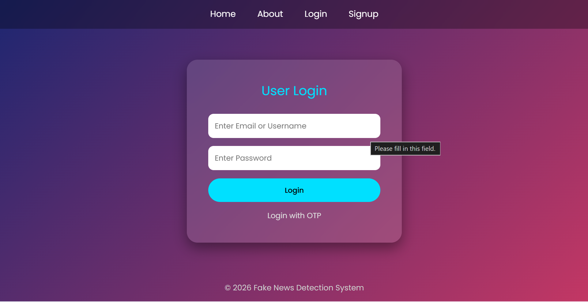

# Fake-News-Detection-Using-BERT
A Fake News Detection Web Application using BERT and Django.
# 📰 Fake News Detection Using BERT


## 📌 Overview

Fake News Detection is a Natural Language Processing (NLP) web application that classifies news articles as **Fake** or **Real** using Google's BERT Transformer model.

The application is developed using Django and provides a user-friendly interface for predicting the authenticity of news content.

---

## ✨ Features

- User Registration & Login
- OTP Verification
- Fake News Detection
- BERT-based NLP Model
- Prediction History
- Admin Dashboard
- Contact Form
- Responsive UI

---

## 🛠 Tech Stack

### Frontend

- HTML5
- CSS3
- Bootstrap
- JavaScript

### Backend

- Django
- Python

### Machine Learning

- BERT
- Hugging Face Transformers
- PyTorch

### Database

- SQLite

---

## 📂 Project Structure

```text
app/
global_project/
static/
templates/
manage.py
requirements.txt
```

---

## 🚀 Installation

Clone the repository

```bash
git clone https://github.com/gauri426/Fake-News-Detection-Using-BERT.git
```

Install dependencies

```bash
pip install -r requirements.txt
```

No NVIDIA GPU? Install the much smaller CPU build of PyTorch first:

```bash
pip install torch==2.11.0 --index-url https://download.pytorch.org/whl/cpu
```

Download the BERT model (~420 MB, [Pulk17/Fake-News-Detection](https://huggingface.co/Pulk17/Fake-News-Detection))

```bash
python download_model.py
```

Create the database

```bash
python manage.py migrate
```

Run server

```bash
python manage.py runserver
```

The first admin account can be created at `/admin_registration/`; after that, only a logged-in admin can add admins.

### Configuration (environment variables)

| Variable | Purpose |
|---|---|
| `EMAIL_HOST_USER`, `EMAIL_HOST_PASSWORD` | Gmail address + app password for OTP emails. If unset, OTP emails are printed in the runserver terminal. |
| `DJANGO_SECRET_KEY` | Secret key (required for any real deployment) |
| `DJANGO_DEBUG` | `False` in production |
| `DJANGO_ALLOWED_HOSTS` | Comma-separated hostnames |

Run the tests

```bash
python manage.py test app
```

Open

```
http://127.0.0.1:8000
```

---

# 📸 Screenshot Gallery

## 🏠 Home Page


---

## 🔐 Login Page



---

## 📰 News Detection


---

## ✅ Prediction Result


---

## 📈 Future Improvements

- News URL Detection
- Multilingual News Detection
- Explainable AI
- Real-time News API Integration
- Mobile Application

---

## 👩‍💻 Author

**Gauri Deshmukh**

Computer Engineering Graduate


# fake-news-detection
