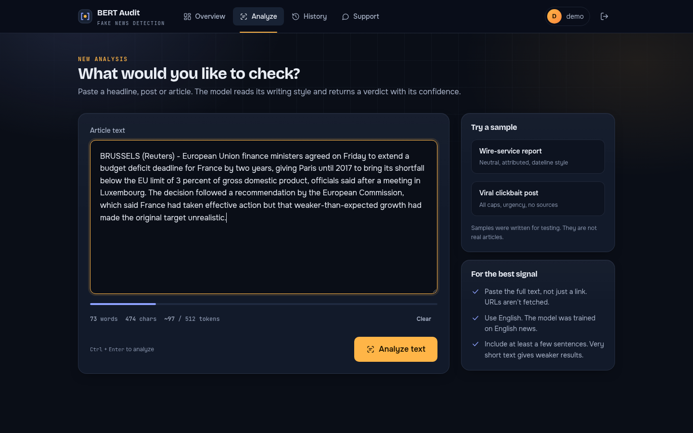
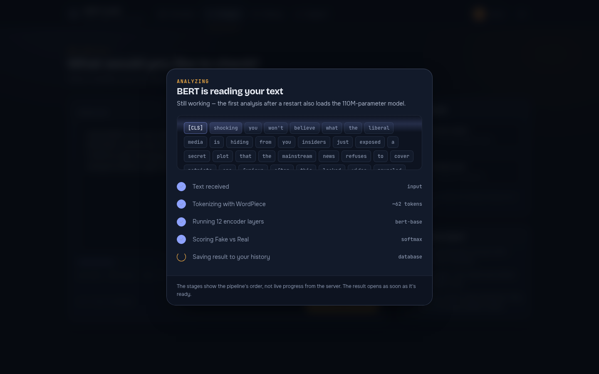
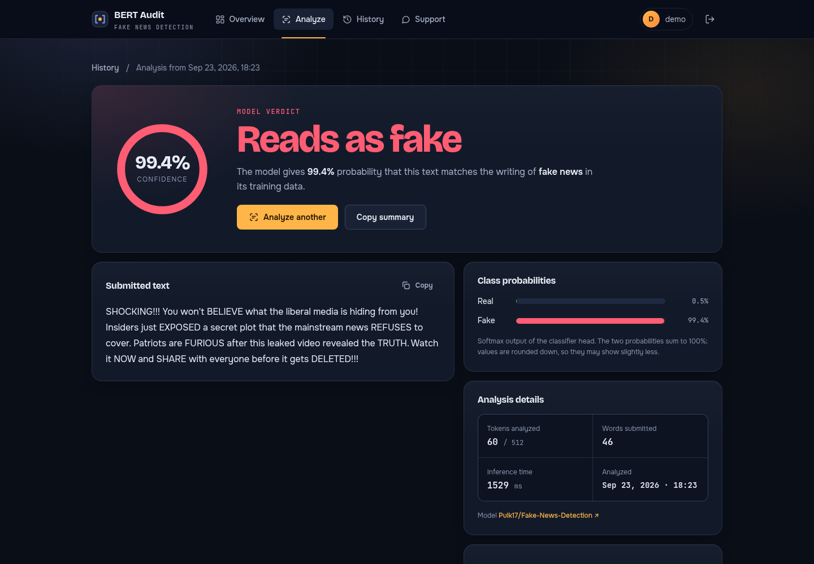
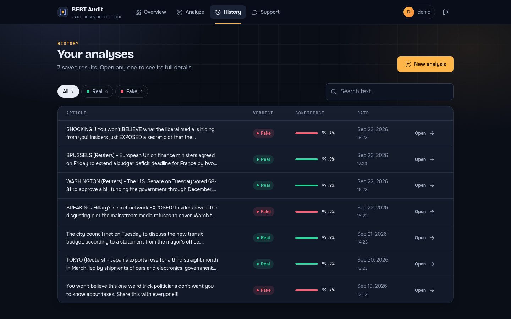
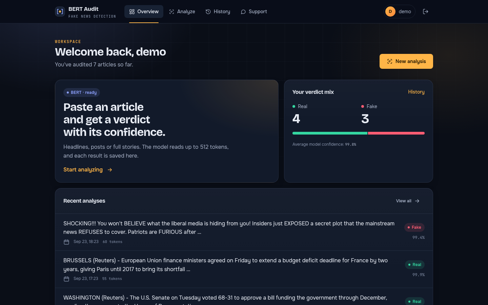
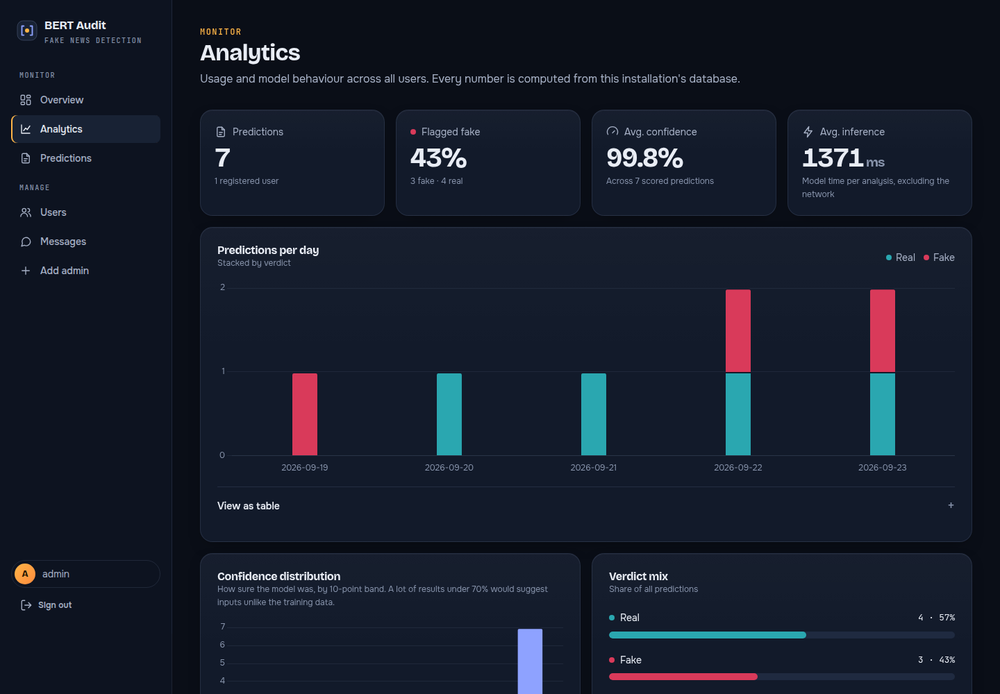
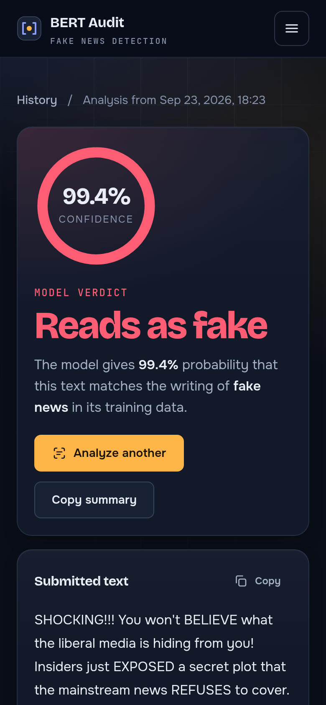
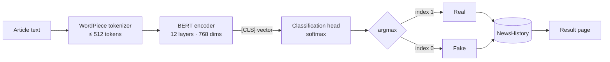

<div align="center">

# Fake News BERT Audit

**Check how a news story reads before you share it.**

A Django web application that runs a fine-tuned BERT transformer on news text and returns a
**Real / Fake** verdict with the model's confidence, saved to a searchable personal history.

[](https://www.python.org/)
[](https://www.djangoproject.com/)
[](https://pytorch.org/)
[](https://huggingface.co/docs/transformers)
[](https://huggingface.co/Pulk17/Fake-News-Detection)

[Features](#features) · [How it works](#how-it-works) · [Quick start](#quick-start) · [Configuration](#configuration) · [Testing](#testing) · [Limitations](#model--limitations) · [Deployment](#deployment)

<br>


</div>

---

## Overview

Fake News BERT Audit classifies the **writing style** of a headline or article as typical of real reporting or of fake news. Paste text into the analyzer, and a
[`bert-base-uncased`](https://huggingface.co/google-bert/bert-base-uncased) model fine-tuned for fake-news detection reads up to 512 tokens and returns:

- a **verdict** (Real or Fake) and the **confidence** behind it,
- the probability of **both classes**,
- **analysis details**: tokens used, whether the text was truncated, and inference time.

Every result is stored in the user's history. Administrators get a console with usage analytics, prediction review, user moderation and a support inbox.

Inference runs **locally on your server** (CPU or GPU). Submitted text is never sent to a third-party AI API.

> [!IMPORTANT]
> The model judges language patterns, not facts. It is a first signal to prompt a closer look, not a fact-checker. See [Model & limitations](#model--limitations).

## Screenshots

<table>
  <tr>
    <td width="50%"><br><sub><b>Analyzer:</b> live word/token counter with a 512-token budget meter and sample texts.</sub></td>
    <td width="50%"><br><sub><b>Processing:</b> the text is shown as tokens while the pipeline stages advance.</sub></td>
  </tr>
  <tr>
    <td><br><sub><b>Result:</b> verdict, confidence gauge, class probabilities and analysis details.</sub></td>
    <td><br><sub><b>History:</b> filter by verdict, search the text, reopen any result.</sub></td>
  </tr>
  <tr>
    <td><br><sub><b>Workspace:</b> personal verdict mix and recent analyses.</sub></td>
    <td><br><sub><b>Admin analytics:</b> daily volume by verdict, confidence distribution, latency.</sub></td>
  </tr>
</table>

<p align="center">
  
  &nbsp;&nbsp;
  
  <br><sub>Fully responsive: phone layouts are designed, not just shrunk.</sub>
</p>

<sub>All verdicts and percentages in these screenshots are real output from the bundled model. The sample texts were written for testing and are not real articles.</sub>

## Features

**Analysis**
- Real / Fake classification with a fine-tuned BERT model (110M parameters).
- Confidence score plus the probability of both classes. Results below 70% confidence are flagged as low confidence.
- Truncation is disclosed: a live token meter while typing, and a notice on the result if text passed the 512-token window.
- A permanent result page (`/result/<id>/`) for every analysis. Refreshing never submits the article again.

**Accounts & history**
- Registration and password sign-in, with passwords hashed using Django's PBKDF2.
- Passwordless sign-in with a 6-digit email code: valid for 10 minutes, locked after 5 wrong attempts.
- Private, searchable history filterable by verdict, with pagination.

**Administration**
- Overview dashboard: users, predictions, fake-flag rate and messages.
- Analytics: predictions per day by verdict, confidence distribution, average inference time, with a table view for every chart.
- Prediction log filterable by date and verdict. User ban, unban and delete, each behind a confirmation dialog.
- Support inbox fed by the public and in-app contact forms.

**Interface**
- A consistent design system across four layouts: public, sign-in, workspace and admin.
- Accessible: semantic HTML, keyboard focus states, WCAG AA text contrast, colour-blind-safe chart palette, reduced-motion support.
- No frontend framework. The UI is one stylesheet and one small vanilla JavaScript file (Chart.js is loaded only on the analytics page).

## How it works



1. **Tokenize.** The text is lower-cased and split into WordPiece tokens (30,522-entry vocabulary), wrapped in `[CLS]` … `[SEP]`. Anything past 512 tokens is cut off and flagged.
2. **Encode.** Twelve transformer layers build a contextual representation of every token.
3. **Classify.** A linear head scores the `[CLS]` vector. Softmax turns the scores into P(Fake) and P(Real).
4. **Store & show.** The label, probability, token count, truncation flag and latency are saved, and the user is redirected to the result page.

The model is loaded lazily on the first prediction, with one warm-up pass so recorded latencies reflect steady-state speed. Management commands such as `migrate` never load it.

## Tech stack

| Layer | Technology |
|---|---|
| Web framework | Django 5.2 (server-rendered templates, sessions, CSRF protection) |
| ML runtime | PyTorch 2.11, Hugging Face Transformers 5.5 |
| Model | [`Pulk17/Fake-News-Detection`](https://huggingface.co/Pulk17/Fake-News-Detection), fine-tuned `bert-base-uncased` (Apache-2.0) |
| Database | SQLite (default; any Django-supported database works) |
| Frontend | Custom CSS design system, vanilla JavaScript, Chart.js 4 (admin analytics only) |
| Email | Django email backend: SMTP, or console output in development |

## Quick start

**Prerequisites:** Python 3.10+ (developed and tested on 3.12), about 2 GB of free disk space, and git.

```bash
# 1. Clone
git clone https://github.com/rumanmushtaq/fake-news-detection.git
cd fake-news-detection

# 2. Create and activate a virtual environment
python3 -m venv venv
source venv/bin/activate            # Windows: venv\Scripts\activate

# 3. Install PyTorch (CPU build shown; skip this line if you have a CUDA GPU)
pip install torch==2.11.0 --index-url https://download.pytorch.org/whl/cpu

# 4. Install the rest of the dependencies
pip install -r requirements.txt

# 5. Download the model (~420 MB) into ./bert_fake_news_model
python download_model.py

# 6. Create the database
python manage.py migrate

# 7. Run
python manage.py runserver
```

Open **http://127.0.0.1:8000**, create an account and analyze your first article.

**First admin:** visit `/admin_registration/` to create the first administrator. The page closes to the public as soon as one admin exists. After that, only a signed-in admin can add more.

> [!TIP]
> Without email credentials, OTP sign-in still works: the code is printed in the terminal running `runserver`.

## Configuration

All settings are read from environment variables, with development-friendly defaults.

| Variable | Default | Description |
|---|---|---|
| `DJANGO_SECRET_KEY` | insecure dev key | **Required in production.** Cryptographic signing key. |
| `DJANGO_DEBUG` | `True` | Set to `False` in production. |
| `DJANGO_ALLOWED_HOSTS` | `localhost,127.0.0.1` | Comma-separated hostnames the site is served on. |
| `EMAIL_HOST_USER` | — | SMTP username (e.g. a Gmail address) for OTP emails. |
| `EMAIL_HOST_PASSWORD` | — | SMTP password (for Gmail, an [app password](https://support.google.com/accounts/answer/185833)). |
| `EMAIL_HOST` | `smtp.gmail.com` | SMTP server. |
| `EMAIL_PORT` | `587` | SMTP port (TLS). |

If `EMAIL_HOST_USER` or `EMAIL_HOST_PASSWORD` is missing, emails go to the console backend.

## Project structure

```text
.
├── app/                        # Django application
│   ├── models.py               # User, AdminData, Contact, NewsHistory
│   ├── views.py                # Pages, auth/OTP, BERT inference, admin console
│   ├── urls.py                 # Route table
│   ├── tests.py                # 36 tests (unit, integration, real-model end-to-end)
│   └── migrations/
├── global_project/             # Project settings, root URLs, WSGI/ASGI
├── templates/
│   ├── base.html               # Document shell, toasts, confirm dialog
│   ├── layouts/                # public · auth · app (workspace) · admin
│   ├── partials/               # brand, icon set, confidence gauge
│   ├── admin_dir/              # Admin console pages
│   ├── OTP/                    # Email-code sign-in
│   └── *.html                  # Landing, analyzer, result, history, …
├── static/
│   ├── css/app.css             # Design system (tokens, components, layouts)
│   └── js/app.js               # UI behaviour (no dependencies)
├── docs/screenshots/           # README images
├── download_model.py           # Fetches the model from Hugging Face
├── manage.py
└── requirements.txt
```

The `bert_fake_news_model/` folder, `db.sqlite3` and `venv/` are generated locally and excluded from git.

## Routes

| Path | Access | Purpose |
|---|---|---|
| `/` | Public | Landing page |
| `/about/` · `/contact/` | Public | Model & method · contact form |
| `/user_registration/` · `/user_login/` | Public | Account creation · password sign-in |
| `/otp_login_home/` · `/otp_login_home/verify_otp/` | Public | Email-code sign-in |
| `/user_home/` | User | Workspace overview |
| `/detect/` | User | Analyzer (`POST news_text`) |
| `/result/<id>/` | Owner | Saved analysis |
| `/history/` | User | History (`?result=Real\|Fake`, `?q=search`, `?page=n`) |
| `/api/sample-analysis/` | Public | JSON: live model output on two fixed sample texts (cached; used by the landing page) |
| `/admin_login/` · `/admin_registration/` | Public / Admin | Admin sign-in · first-admin setup |
| `/admin_home/` · `/view_stat/` · `/news_history/` | Admin | Overview · analytics · prediction log |
| `/view_user/` · `/view_contact/` | Admin | Users · support inbox |
| `/ban-user/<id>/` · `/unban-user/<id>/` · `/delete-user/<id>/` | Admin, `POST` | Moderation (CSRF-protected) |

## Testing

```bash
python manage.py test app
```

The suite has **36 tests** covering registration and sign-in, password hashing, the full OTP flow (expiry, attempt limit, resend, banned users), access control for every user and admin page, result ownership, history filters, the contact form, admin moderation, protection against serving project files, and end-to-end runs through the real model.

Real-model tests are skipped automatically if `bert_fake_news_model/` is missing. With the model present, the suite takes about 3–4 minutes on a laptop CPU.

## Model & limitations

| | |
|---|---|
| Model | [`Pulk17/Fake-News-Detection`](https://huggingface.co/Pulk17/Fake-News-Detection) |
| Base | `bert-base-uncased`: 12 layers, 768 hidden, 12 heads, ~110M parameters |
| Input | English text, max 512 tokens |
| Output | 2 classes: index 0 = Fake, index 1 = Real |
| Training data | [`Pulk17/Fake-News-Detection-dataset`](https://huggingface.co/datasets/Pulk17/Fake-News-Detection-dataset): "real" is mostly Reuters wire copy, "fake" is from sites flagged for misinformation |

**Know the limits before relying on a verdict:**

- It classifies **style**, not truth. A false story written in sober wire-service style can be labeled Real, and informal but accurate reporting can be labeled Fake.
- It learned from mostly **US political news from 2016–2017**. Accuracy drops on other topics, periods and languages.
- It is often **highly confident**. High confidence means the text looks very typical of one class, not that the verdict is correct.
- Only the **first 512 tokens** (~390 words) are read.

The model card reports high accuracy on its own held-out split. Performance on your content will differ, so evaluate on representative data before relying on it.

## Deployment

The development server is not meant for production. Before going live:

- [ ] Set `DJANGO_DEBUG=False`, a strong `DJANGO_SECRET_KEY`, and `DJANGO_ALLOWED_HOSTS`.
- [ ] Serve behind HTTPS and a production WSGI server (e.g. Gunicorn or uWSGI). Neither is included in `requirements.txt`.
- [ ] Run `python manage.py collectstatic` (output goes to `staticfiles/`) and serve it from your web server or a CDN.
- [ ] Configure SMTP credentials for OTP email.
- [ ] Plan memory: **each worker process loads its own copy of the model (~0.5 GB RAM)**.
- [ ] For multi-user traffic, consider PostgreSQL instead of SQLite.

## Roadmap

These are ideas, **not yet implemented**:

- Fetch and analyze an article from a URL
- Token-level explanations (e.g. attention or gradient attribution)
- Multilingual support with a multilingual encoder
- REST API with token authentication
- Background job queue for long articles

Contributions toward any of these are welcome.

## Contributing

1. Fork the repository and create a feature branch.
2. Keep changes focused. Follow the existing design system (`static/css/app.css`) for any UI work.
3. Add or update tests, and make sure `python manage.py test app` passes.
4. Open a pull request describing **what** changed and **why**.

## Acknowledgements

- **Original project:** Gauri Deshmukh, [Fake-News-Detection-Using-BERT](https://github.com/gauri426/Fake-News-Detection-Using-BERT)
- **Model:** [Pulk17/Fake-News-Detection](https://huggingface.co/Pulk17/Fake-News-Detection) (Apache-2.0)
- **BERT:** Devlin et al., [*BERT: Pre-training of Deep Bidirectional Transformers for Language Understanding*](https://arxiv.org/abs/1810.04805), NAACL 2019
- Built with [Django](https://www.djangoproject.com/), [PyTorch](https://pytorch.org/), [Hugging Face Transformers](https://huggingface.co/docs/transformers) and [Chart.js](https://www.chartjs.org/)

## License

This repository does not include a license file yet, so default copyright applies and others may not reuse the code. Add a `LICENSE` file (e.g. MIT or Apache-2.0) to define terms, and confirm compatibility with the original project. The bundled model is licensed separately under Apache-2.0.

---

<div align="center"><sub>Verdicts are statistical estimates. Always check important claims against primary sources.</sub></div>
